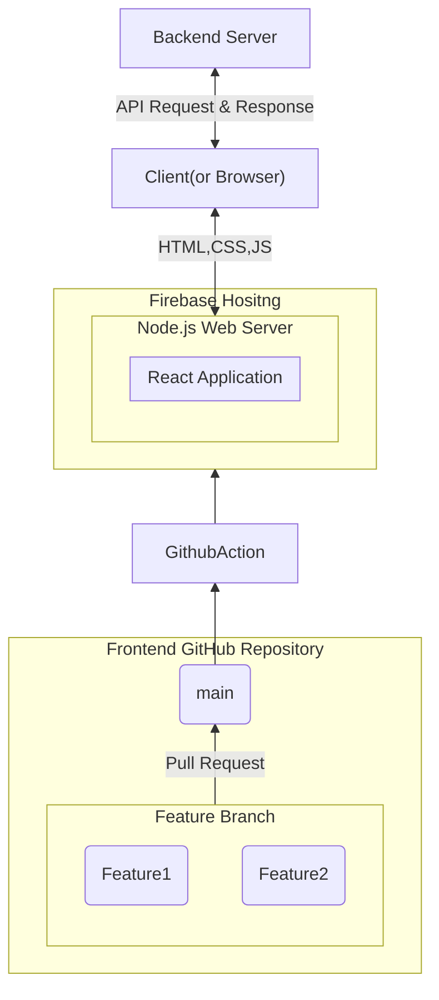
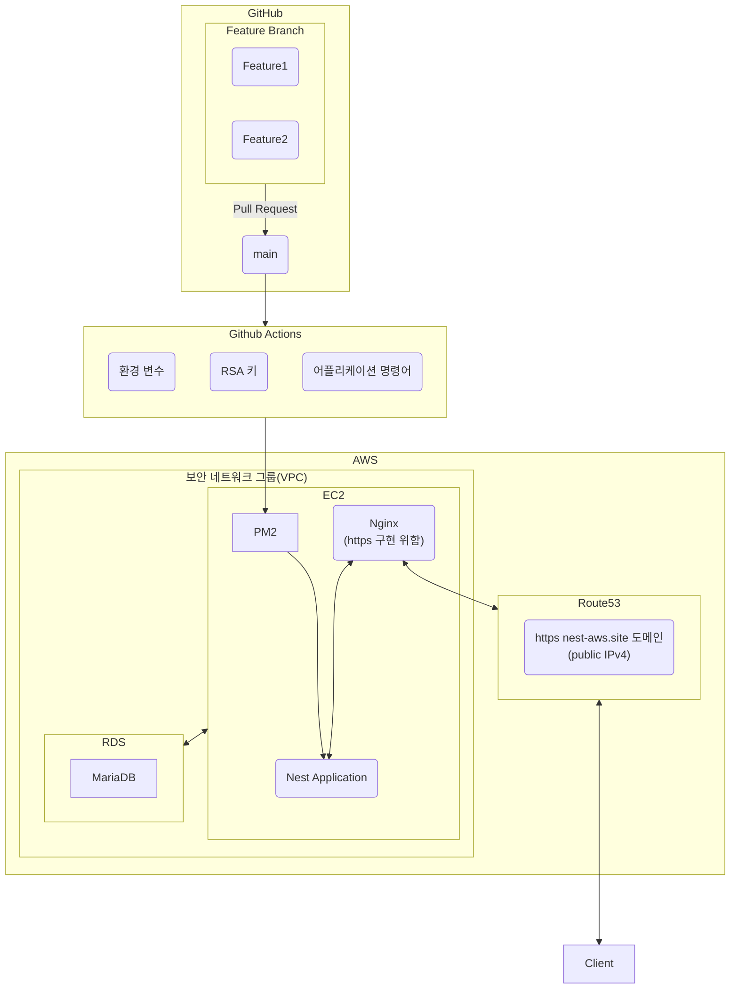

# 📖 Link Up

- 코딩 스터디부터 러닝 크루까지 다양한 모임을 만들고 찾을 수 있는 서비스입니다.
- 프로젝트 기간 : 24년 12월 6일(금) ~ 24년 12월 23일(월) (약 2주)

[프로젝트 깃허브](https://github.com/Team-LinkUp)
[프론트 깃허브](https://github.com/chaesunbak/study-matcher-frontend)
[백엔드 깃허브](https://github.com/damhyeong/Programmers_TeamRepo)
[팀 노션 페이지](https://www.notion.so/Link-Up-2882ea41fbc64059970ebd5e8e3962c2?pvs=4)

## 1. 팀원 구성

## Team

|||||
|:-:|:-:|:-:|:-:|
|Cho SeungYeon [@layout-SY](https://github.com/layout-SY)|[@chaesunbak](https://github.com/chaesunbak)|damhyeong [@damhyeong](https://github.com/damhyeong)|[@Kim-Hyunhee](https://github.com/Kim-Hyunhee)|
|프론트엔드|프론트엔드|백엔드|백엔드|

## 2. 역할 분담

### 🍊 조승연

- 유저 페이지
- 글, 댓글 페이지

### 👻 채문성

- 모임찾기, 모임 상세보기 페이지
- 반응형 레이아웃

### 🌝 공담형

- 유저 CRUD API 제작
- CI / CD 제작
- AWS 인프라 관리

### 😎 김현희

- 모임, 게시글, 댓글 CRUD API 제작

 

## 3. 기술스택

### 프론트엔드
     

### 백엔드

   

### 협업

 

### 배포

   

## 4. 서비스 흐름도

 

프론트엔드 서비스 흐름도

<!-- summary 아래 한칸 공백 두어야함 -->

백엔드 서비스 흐름도

<!-- summary 아래 한칸 공백 두어야함 -->

## 5. 주요 기능

- 모임 찾기 기능 : 주제와 키워드별로 원하는 모임을 찾을 수 있어요.

- 모임 생성 기능 : 내 모임을 만들 수 있어요.

- 모임 찾기 기능 : 원하는 모임에 참여할 수 있어요.

- 모임 게시판 기능 : 모임 게시판에 글과 댓글을 남길 수 있어요.

- 내 정보 관리 기능 : 내 정보를 관리할 수 있어요

## 6. 트러블 슈팅

## 7. 회고

### 조승연

- CRUD만 하면 된다는 단순한 생각으로 시작했지만 그 무엇보다 기본에 충실한 프로젝트 였다고 생각합니다.
유효성 검사와 예외 처리를 통해 UX에 부정적인 영향을 끼치지 않게끔 사용자 관점에서 생각해보려 노력했고 이를 통해 다양한 방식으로 개발을 진행하며 각종 라이브러리와 기술의 필요성을 느끼며 그 사용의 목적성이 뚜렷해지는 시간이었습니다.

이번 경험으로 다름 많은 기술을들을 알아보고, 배우며 나에게 직면한 상황에 알맞는 기술을 만들어보고 싶단 목표가 생겼습니다.

### 👻 채문성

- 그저 CRUD는 단순할 것이라고 얕보았지만, 실제 개발 과정에서는 여러 예외 상황들을 마주하면서, 로딩중, 데이터 없음, 에러, 권한없음 같은 다양한 상황에서 유저에게 올바른 피드백을 제공하는 것이 중요하다는 것 배우는 소중한 경험을 했습니다.
 또한, 바로 코드를 치기보다는,  사전에 구체적인 계획을 세우고 어떤 어려움이 있을지 정리하고, 어떤 부분에 있어서 학습이 필요할지 파악하는 것이, 성장하고 생산성을 높이는데에서 중요하다고 느꼈습니다. 프로젝트 초반에는 여유가 있었는데 이때, 예상되는 문제들을 파악하고, React Query를 통한 Optimistic Update 같은 개념들을 미리 학습하였다면 이를 적용할 시간이 충분하였을 것 같다는 아쉬움이 남습니다.
 처음으로 풀스택 팀 프로젝트를 진행해보면서, 공유해야될 정보가 많았는데 이를 어떻게 하면 효율적으로 전달하고 관리할수 있을까 고민할 수 있었습니다. 문서로 효과적으로 소통하는 법을 시도해보면서 팀 전체의 생산성을 올리기 위한 방법을 고민해볼 수 있었던 좋은 경험이었습니다.

<!--

**Here are some ideas to get you started:**

🙋‍♀️ A short introduction - what is your organization all about?
🌈 Contribution guidelines - how can the community get involved?
👩‍💻 Useful resources - where can the community find your docs? Is there anything else the community should know?
🍿 Fun facts - what does your team eat for breakfast?
🧙 Remember, you can do mighty things with the power of [Markdown](https://docs.github.com/github/writing-on-github/getting-started-with-writing-and-formatting-on-github/basic-writing-and-formatting-syntax)
-->
