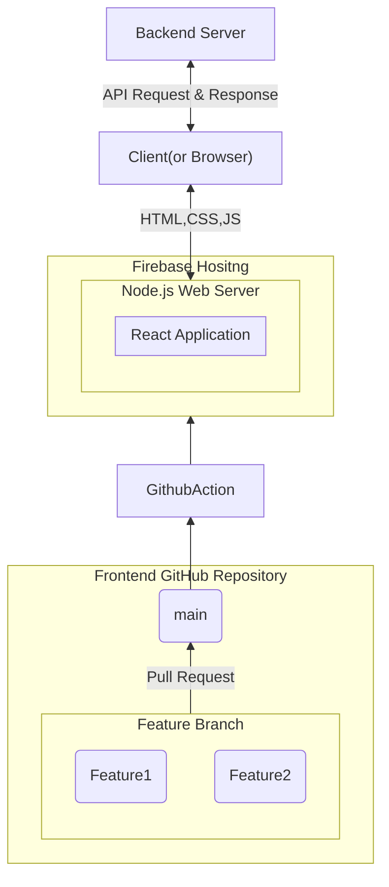
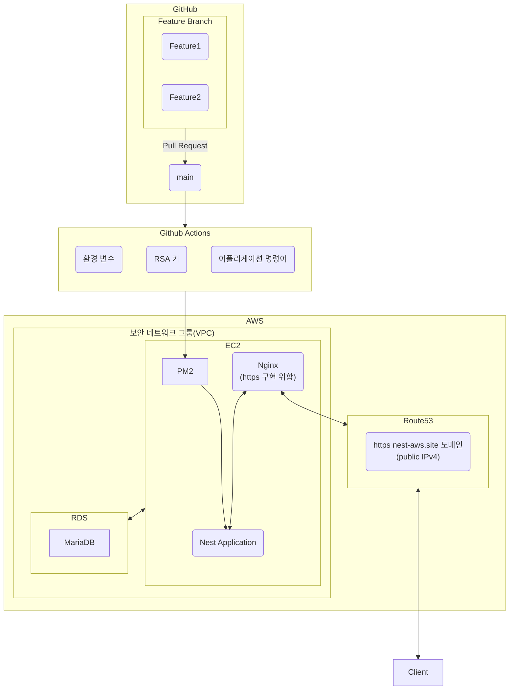

# 📖 Link Up

- 코딩 스터디부터 러닝 크루까지 다양한 모임을 만들고 찾을 수 있는 서비스입니다.
- 프로젝트 기간 : 24년 12월 6일(금) ~ 24년 12월 23일(월) (약 2주)

## 1. 팀원 구성

| **조승연** | **채문성** | 공담형 | 김현희 |
| --- | --- | --- | --- |
| [   @layout-SY | [   @chaesunbak | [img src="](https://github.com/chaesunbak)[https://avatars.githubusercontent.com](https://avatars.githubusercontent.com/u/152577867?v=4)/damhyeong” /> | https://avatars.githubusercontent.com/Kim-Hyunhee |
| 프론트엔드 | 프론트엔드 | 백엔드 | 백엔드 |

## 2. 역할 분담

### 🍊 조승연

- 유저 페이지
- 글, 댓글 페이지

### 👻 채문성

- 모임찾기, 모임 상세보기 페이지
- 반응형 레이아웃

### 🌝 공담형

- 유저 CRUD API 제작
- CI / CD 제작
- AWS 인프라 관리

### 😎 김현희

- 모임, 게시글, 댓글 CRUD API 제작

 

## 3. 기술스택

### 프론트엔드
     

### 백엔드

   

### 협업

 

### 배포

   

## 4. 서비스 흐름도

 

프론트엔드 서비스 흐름도

<!-- summary 아래 한칸 공백 두어야함 -->

백엔드 서비스 흐름도

<!-- summary 아래 한칸 공백 두어야함 -->

<!--

**Here are some ideas to get you started:**

🙋‍♀️ A short introduction - what is your organization all about?
🌈 Contribution guidelines - how can the community get involved?
👩‍💻 Useful resources - where can the community find your docs? Is there anything else the community should know?
🍿 Fun facts - what does your team eat for breakfast?
🧙 Remember, you can do mighty things with the power of [Markdown](https://docs.github.com/github/writing-on-github/getting-started-with-writing-and-formatting-on-github/basic-writing-and-formatting-syntax)
-->
